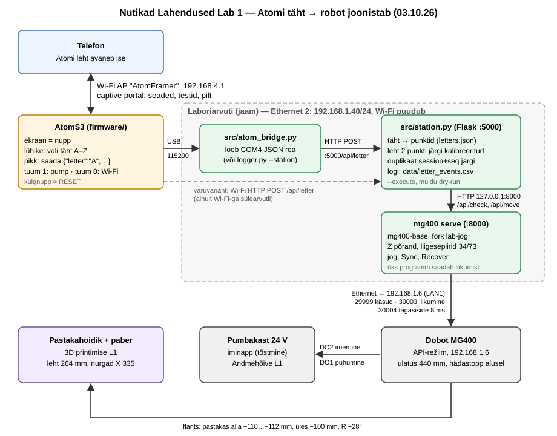
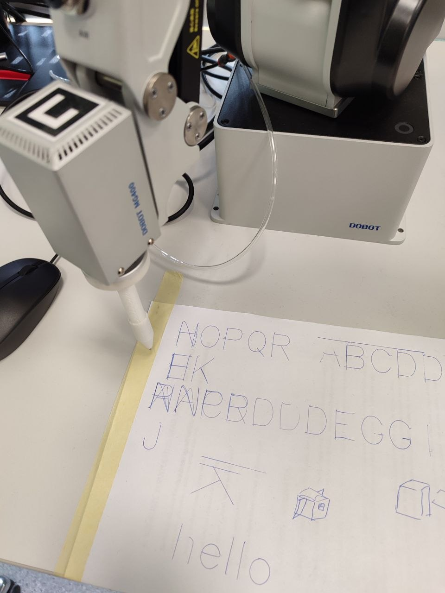
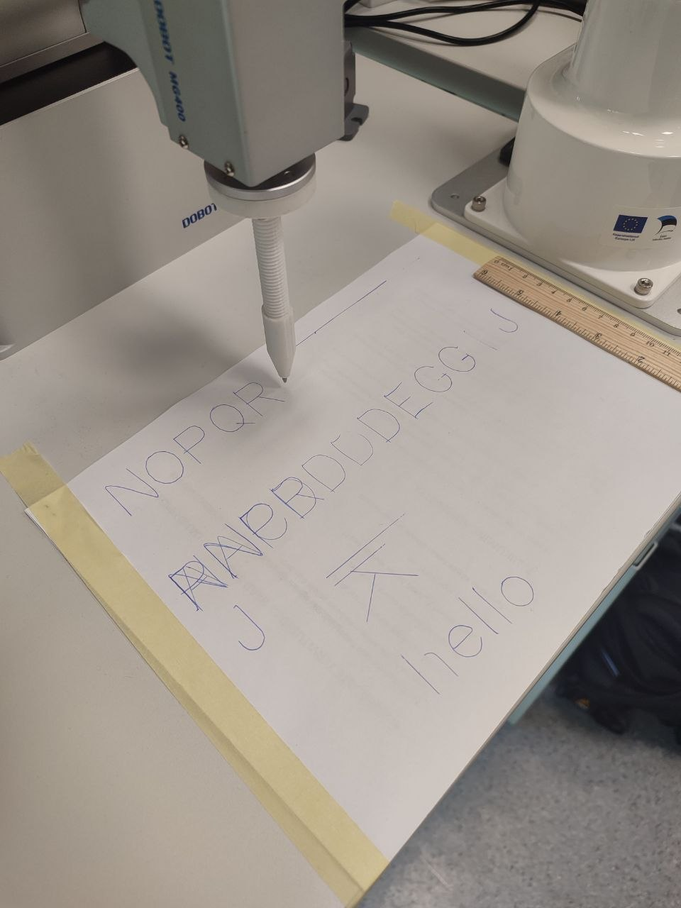
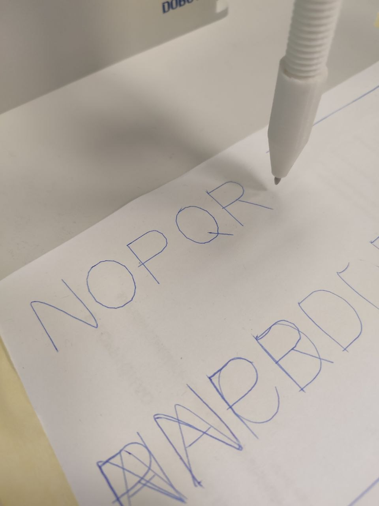

> **Meie lisatud märkus (ei kuulu õpetaja originaalülesande teksti):** See fail on elav tööleht. Reaalsed mõõtmised, koordinaadid ja katsetulemused lisatakse laboris.

---

## Nutikad Lahendused: Labor 1 — Robot, ekraan ja tähemasin

**Töömaht:** 28 tundi | **Hindamine:** 20 punkti | **Meeskond:** 3 tudengit | **Välja antud:** 12.09.26 | **Tellimise kuupäev:** 22.09.26 | **Esimene kaitsmine:** 06.10.26, veebis

### Kuidas see dokument töötab

* Kopeeri see fail esimesel päeval oma repo laborikausta `README.md`-ks ja täida seal, töö käigus.
* KAARDISTA ise on puudu, sest vastust ei tea veel keegi. Sina ise mõõdad ja kirjutad numbri ja põhjuse siia.
* Midagi ei kustutata. Vale number jääb, kuupäevaga, parandus tuleb tema alla.
* Kirjuta nii, et meeskonnakaaslane, kes sel päeval ruumis ei olnud, saab aru: päris failinimed, päris numbrid, ühikud.
* Skeemid ja simulatsioonid lähevad dokumenti pildina, pildi juurde link elavale failile, et teine saaks selle lahti teha ja edasi muuta. Näited on Andmehõive Labori 1 töölehel: Falstadi simulatsioon ja draw.io skeem. Tee enda omad samade tööriistadega.
* Tähtaeg ei ole tähtis. Tähtis on, et asi saab tehtud ja sa saad aru. Ei tulnud esimesel korral välja, tule homme tagasi ja proovi uuesti. Kaitsta saab nii mitu korda, kui vaja.

### Eesmärk

Sama meeskond teeb kõiki kolme ainet. Iga aine annab ühe tüki:

* **Andmehõive** teeb AtomS3, mille nupp valib tähe ja saadab selle välja.
* **3D printimine** teeb pastakahoidiku, mis käib roboti käe otsa (flantsi külge).
* **Robotil MG400** on võrguport, kust ta võtab vastu liikumiskäske.

Igaüks neist töötab eraldi. Aga eraldi ei joonista neist ükski. Puudu on see osa, mis võtab tähe Atomist vastu ja teeb sellest roboti liigutused. Selle osa teed sina selles laboris. Kõik kolm ainet lõpevad ühe demoga: **vajuta Atomil tähte, robot joonistab selle paberile.**

**Jaam** on selles dokumendis sinu sülearvuti, kus jookseb Pythoni programm. Jaam räägib Atomiga üle WiFi ja robotiga üle Etherneti.

Selles laboris on kolm osa:

1. **Robot.** Pane MG400 tööle oma sülearvutist. Õppejõud annab baaspaketi: Pythoni programm, mis avab brauseris lehe liugurite, salvestatud asendite ja pumba nuppudega. Sinu töö: pane pakett tööle, kontrolli, kas paketi eeldused (aadressid, pumba liinid) vastavad tõele, ja õpeta robotile neli asendit.
2. **Ekraan.** Laadi AtomS3-le PlatformIO-st püsivara, mis teeb oma WiFi võrgu ja näitab lehte, kust saab pildi ekraanile saata. Kui telefon selle võrguga liitub, peab leht ise lahti minema, ilma et keegi aadressi trükiks. Lehele tuleb ka seadete ja testinuppude osa. See leht jääb kogu aastaks: kõik, mis hiljem Atomi külge tuleb (rõhuandur, UART, klapp, LED), saab oma seaded ja testinupu siia, mitte eraldi lehele.
3. **Täht.** Atomi nupp valib tähe. Täht jõuab jaama. Jaam saadab robotile liikumiskäsud ja robot joonistab tähe paberile. Vähemalt kolm tähte.

Esimene asi on tellimus. Esimesel päeval uusi osi ei ole: mõtle välja, mida see labor üldse vajab ja mis riiulil puudu on, ja kirjuta see tellimuseks, mis läheb välja 22.09. Tellitu jõuab kohale selle labori ajal. Seni ehita sellest, mis riiulil on.

*See on elav dokument. Uuenda eesmärke, kui need töö käigus muutuvad — uued teadmised teevad vanad eesmärgid vahel mõttetuks. Mõte on hoida meeskond kogu aeg sihil, et ei eksitaks detailide metsa ja põhiprobleem ei jääks lahendamata.*

**KAARDISTA ISE — eesmärk nii, nagu ta tegelikult välja tuli.**

*03.10.26:* Meie prototüüp-pastakahoidikuga (3D printimise L1) õppida robotit juhtima nii, et ta kirjutab tähti ja teksti; uurida, kuidas robot töötab, ja testida 3D-prinditud pastakahoidikut: kui hästi ta joonistab, kui leht ei ole tugevalt kinni. Tulemus: tähed on kohati natuke ebaühtlased, aga üldiselt on tulemus väga hea — Atomil vajutatud täht jõuab jaama ja robot joonistab selle paberile (initsiaalid D, N, R; 20 mm tähed).

### Kontrollnimekiri

**Peab olema tehtud**

- [x] Tellimus 22.09: mis selle labori jaoks riiulil puudu on, failis `docs/bom.md`.
  * 03.10.26: `docs/bom.md` täidetud; tellida ei olnud vaja midagi, ainus puudus (laboriarvutil Wi-Fi puudub) lahendati USB kanaliga.
- [x] Robot on API-režiimis. `mg400 status` vastab. Leht liigutab robotit. Pump imeb ja puhub käsurealt.
  * 03.10.26: kinnitatud — Raimo arvutil esimene kontroll (vt allpool), 02.10.26 laboriarvutil pumba DO2 = imemine / DO1 = puhumine ja kümme võtmist, 03.10.26 tähtede joonistamine API kaudu (`mg400 serve`, 127.0.0.1:8000).
- [x] Neli asendit õpetatud. Robot tõstab proovitüki allikast valmis pessa kümme korda järjest.
  * 03.10.26: kümme võtmist 10/10 tehti 02.10.26 Andmehõive katses samal robotil (`docs/pick_test.csv`); `positions.json` neli asendit tuleb iminapaga uuesti õpetada (02.10 asendeid server ei salvestanud).
  * 03.10.26 parandus: eelmine rida on vale — asendeid ei kadunud. 02.10.26 katses (`pick_in_place.py --approach`) ei kasutatud serveri salvestatud asendeid: tõste tehti ühes punktis X 259, Y 27, R −72, klaas Z −103, tõste +20 mm. Need koordinaadid on nüüd `data/positions.json`-is; allikas ja valmis pesa on sama koht.
  * Lõpptulemus: hiljem tehti füüsiline pick-and-place allikast valmis pessa 10/10. Selle katse neli lõplikku koordinaati eraldi reposse ei salvestatud. `data/positions.json` ja `docs/pick_test.csv` kirjeldavad endiselt 02.10.26 ühe punkti vahekatset, mitte hilisema source → finished katse koordinaate.
- [x] AtomS3 püsivara on PlatformIO-st peale laetud. Atom teeb oma WiFi võrgu. Telefon liitub ja leht avaneb ise, ilma aadressi trükkimata. Pilt jõuab lehelt ekraanile.
  * 03.10.26: püsivara PlatformIO-st peal, Atom teeb võrgu `AtomFramer` (192.168.4.1). Telefoni test ja pildi saatmine: TODO.
  * 03.10.26 pärastlõuna: Android-telefon liitus, leht avanes ise (telefon küsis `connectivitycheck.gstatic.com/generate_204`); 128 × 128 pilt jõudis ekraanile (`docs/atom_page.md`). iPhone'iga ei kontrollitud.
- [x] Atomi lehel on seadete ja testide osa. Fail `docs/atom_page.md` ütleb, mis seal on.
  * 03.10.26: `docs/atom_page.md` täidetud (võrk, seaded, testid, rõhu rida); lehe kontroll telefoniga TODO.
  * 03.10.26 pärastlõuna: leht kontrollitud Android-telefoniga (seaded: tähe nupurežiim välja/sisse, pildi saatmine).
- [x] Täht: Atomi nupp valib tähe, jaam saab selle kätte, robot joonistab. Kolm tähte.
  * 03.10.26: töötab otsast lõpuni — 15 tähte jõudis jaama, 13 joonistati (A A C D D D D E G G I J J), `data/letter_events.csv`. Initsiaalidest D tehtud, N ja R TODO; latentsus (30 vajutust) TODO.
  * 03.10.26 pärastlõuna: R ja N joonistatud (initsiaalid D, N, R olemas). Robot nihutati, leht kalibreeriti uuesti (`config/robot_calibration.json`). Latentsus: 5 vajutust (ülesanne nõuab 30), `docs/latency.csv`, tehtud `tools/latency_report.py --after-seq 23` abil. Atom → jaam keskmine 4,4 ms, max 12,2 ms (suhteline: Atomil ja arvutil on eri kellad, kiireim vajutus = 0); jaam → esimene robotikäsk keskmine 493,7 ms, max 592,2 ms.
  * Lõpptulemus: õppejõuga lepiti kokku, et selle labori jaoks piisab viiest reaalsest latentsusmõõtmisest. Seetõttu 30 vajutuse seeriat ei tehtud; `docs/latency.csv` sisaldab viit päris mõõtmist.
- [ ] Repo ja arenduspäevik täidetud, tag `smart-solutions-lab1`.
  * Lab 1 dokumentatsioon on valmis. Fotod ja videod lisab ning lõpliku tag'i loob Denys enne esitamist.
  * 08.10.26: kolm fotot tähtede joonistamisest lisatud kausta `docs/images/` (vt Osa 3). Videod ja tag: TODO.

**KAARDISTA ISE — kuupäevad ja sinu enda sammud.**

##### Esimese laborikülastuse kontrollnimekiri

- [x] Kontrolli BOM-i järgi, mis on laboris olemas. *(03.10.26, `docs/bom.md`)*
- [x] Kontrolli, kas sülearvutil on Ethernet või USB-C → Ethernet adapter. *(laboriarvutil 2 Ethernet porti, adapterit ei vaja)*
- [x] Leia MG400 LAN1 port. *(12.09.26)*
- [x] Kontrolli, et hädastopp oleks käeulatuses. *(roboti alusel)*
- [x] Kontrolli MG400 API-režiimi. *(12.09.26, pordid vastavad)*
- [x] Seadista arvuti Ethernet aadress 192.168.1.50 / 255.255.255.0. *(Raimo arvuti .50 12.09.26; laboriarvuti `Ethernet 2` = 192.168.1.40/24, sama alamvõrk)*
- [x] Pingi 192.168.1.6. *(03.10.26: 4/4, 0–1 ms)*
- [x] Kontrolli porte 29999, 30003, 30004. *(03.10.26: kõik avatud, `Test-NetConnection`)*
- [x] Käivita `mg400 status`. *(12.09.26)*
- [x] Käivita `mg400 serve`. *(12.09.26; laboriarvutil 127.0.0.1:8000)*
- [x] Tee esimene liigutus ainult 20% kiirusel. *(12.09.26; joonistus 03.10.26 alustati 2 %-ga)*
- [x] Kontrolli pumbakasti DO liinid juhendi ja multimeetriga. *(02.10.26: DO impulsid + rõhuandur; DO2 imemine, DO1 puhumine)*
- [x] Ära ühenda 24 V pumbakasti juhtmeid enne kontrolli.
- [ ] Pane kõik reaalsed tulemused README-sse ja vajalikesse docs failidesse.

### Sisendid

* Riiulilt: AtomS3, USB-C kaabel, USB-C → Ethernet adapter, LAN kaabel, marker, maalriteip, paber. Proovitükk tõstmise jaoks: AtomS3 näidissilt või mis tahes lameda pealsega asi, umbes 24 × 24 mm.
* Õppejõult: MG400, mis on juba API-režiimis, koos pumbakasti ja iminapa komplektiga. MG400 baaspakett.
* Andmehõive L1-st: täht. Atom saadab ühe JSON rea. Kuidas see rida jaama jõuab (kanal), lepite ise esimesel nädalal kokku. Leppige kokku enne, kui kumbki pool koodi kirjutab.
* 3D printimise L1-st: pastakahoidik, mis käib flantsi külge. Kuni hoidikut ei ole, teibi marker flantsi külge.

### Vahendid

1. MG400 koos iminapa komplektiga ja pumbakastiga
2. Sülearvuti Ethernet pordi või adapteriga; Python 3.11+, venv, pip, Flask
3. MG400 baaspakett: `KKallas/mg400-base` (eraldi repo)
4. AtomS3, USB-C kaabel; VS Code ja PlatformIO laiendus; M5Unified
5. ESP32-Image-Server alguspunktiks (link taustainfos)
6. Telefon, millega Atomi võrku minna
7. Marker, maalriteip, paber; pastakahoidik 3D printimise L1-st, kui valmis
8. Git, üks repo meeskonna kohta, `AGENTS.md` juurkaustas
9. draw.io

*Kui plaan muutub, uuenda ka vahendeid, või tee draw.io skeem, mis näitab, kuidas asjad omavahel töötavad.*

**Süsteemi skeem 03.10.26** (nii, nagu ahel laboris päriselt töötas — täht läheb USB kaudu, sest laboriarvutil Wi-Fi-t ei ole):



Elav fail: [`docs/system_03.10.26.drawio`](docs/system_03.10.26.drawio) (ava https://app.diagrams.net → File → Open). Varasem kavand Wi-Fi kanaliga: [`docs/system.drawio`](docs/system.drawio).

**KAARDISTA ISE — mida sa päriselt kasutasid.**

*03.10.26:*
* **Jaam = laboriarvuti** (lauaarvuti, mitte sülearvuti), Windows, ilma adminiõigusteta, **Wi-Fi-ta**: `Ethernet 2` 192.168.1.40/24 → MG400 LAN1 (192.168.1.6). Esimene katse 12.09.26 Raimo arvutil (192.168.1.50).
* **MG400** API-režiimis; baaspakett **mg400-base** meie forgist `Dennel04/mg400-base`, haru `lab-jog` (parandused: vt osa 1).
* **Python 3.14**, venv repo juurkaustas; Flask (jaam :5000), pyserial (USB sild `src/atom_bridge.py`).
* **AtomS3R**, USB-C; **PlatformIO** (`pio run -t upload --upload-port COM4`), püsivara laadimine ~17 s. Üks püsivara kahe aine jaoks: Andmehõive pump (tuum 1) + Wi-Fi, leht ja tähed (tuum 0).
* **Android-telefon**: Atomi võrk, captive portal, pildi saatmine.
* **Pastakahoidik** 3D printimise L1-st (Raimo disain, vedru annab järele); markerit teibiga ei olnud vaja.
* **draw.io** skeem (`docs/system_03.10.26.drawio`), Git/GitHub (üks repo, PR õppejõu repole).
* AI-abiline (Claude Code): kood, vigade otsimine, testid, dokumentide mustandid.

### Taustainfo

* **MG400 baaspakett**: README ütleb, kuhu kaabel käib ja mis aadress on, ning kirjeldab käsurea ja HTTP API. API-režiim on robotil juba sees. Kui ei ole, on `docs/dobot-api-mode-windows.md` ühekordne juhend Windowsi arvutist ja `docs/dobot-api-mode.md` Macist.
  [https://github.com/KKallas/mg400-base](https://github.com/KKallas/mg400-base)
* **Dobot TCP/IP protokoll**: port 29999 on käsud (EnableRobot, ClearError, DO, GetPose), port 30003 on liikumine (MovL, ServoP), port 30004 on tagasiside iga 8 ms.
  [https://github.com/Dobot-Arm/TCP-IP-Protocol](https://github.com/Dobot-Arm/TCP-IP-Protocol)
  Doboti enda Pythoni näide: [https://github.com/Dobot-Arm/TCP-IP-4Axis-Python](https://github.com/Dobot-Arm/TCP-IP-4Axis-Python)
* **Pumbakast**: otsi fraasi "Dobot MG400 vacuum pump box IO control". Kast on kahel DO liinil. Klemmid on kasti juhendis.
* **AtomS3**: viigud, ekraan, nupp
  [https://docs.m5stack.com/en/core/AtomS3](https://docs.m5stack.com/en/core/AtomS3)
* **PlatformIO**: [https://docs.platformio.org/](https://docs.platformio.org/) ja M5Unified: [https://github.com/m5stack/M5Unified](https://github.com/m5stack/M5Unified)
* **ESP32-Image-Server**: AtomS3 püsivara, mis teeb WiFi võrgu, näitab pilti ja pakub lehte, kust pilt üles laadida. Captive portalit seal veel ei ole. Selle teed sina.
  [https://github.com/KKallas/ESP32-Image-Server](https://github.com/KKallas/ESP32-Image-Server)
* **ESP32 WiFi AP**: [https://randomnerdtutorials.com/esp32-access-point-ap-web-server/](https://randomnerdtutorials.com/esp32-access-point-ap-web-server/)
* **Captive portal**: otsi fraasi "ESP32 captive portal DNSServer generate_204 hotspot-detect". Telefon küsib WiFi-ga liitumisel ühte kindlat aadressi. Kui vastus ei ole see, mida ta ootab, avab ta lehe ise.
* **Flask**: [https://flask.palletsprojects.com/en/stable/quickstart/](https://flask.palletsprojects.com/en/stable/quickstart/)

*Lisa siia oma allikaid ja kasulikku infot, mis aitaks sul projektist aru saada ka aastaid hiljem, kui selle uuesti lahti teed.*

**KAARDISTA ISE — sinu allikad.**

*03.10.26:*
* mg400-base: https://github.com/KKallas/mg400-base ja meie fork https://github.com/Dennel04/mg400-base (haru `lab-jog`).
* Dobot TCP/IP 4-telje juhend (PDF 20240419): https://github.com/Dobot-Arm/TCP-IP-Protocol-4AXis — `MovJ`, `ClearError`, `Continue()` (alates V1.6 vajalik pärast ClearError). **ServoP-d selles juhendis ei kirjeldata**; et ainult R-i muutev ServoP ei liiguta robotit, leidsime ise katsega.
* Dobot Pythoni näide: https://github.com/Dobot-Arm/TCP-IP-4Axis-Python
* AtomS3: https://docs.m5stack.com/en/core/AtomS3; M5Unified; PlatformIO dokumentatsioon.
* ESP32-Image-Server (püsivara alus): https://github.com/KKallas/ESP32-Image-Server
* Captive portal: Androidi kontrollaadress `generate_204`, iOS `hotspot-detect.html`.
* CSS `overscroll-behavior` — keelab Androidi Chrome'is „tõmba värskendamiseks“.

### Osad

#### 1. Robot

Robot on ühendatud LAN1 porti ja tema aadress on 192.168.1.6. Robot on API-režiimis. See tähendab, et ta kuulab porte 29999, 30003 ja 30004 kogu aeg, kui vool on peal, ja ootab sealt käske.

Pane oma arvuti Ethernet pordile käsitsi aadress 192.168.1.50, mask 255.255.255.0, gateway tühi. Kõigepealt ping. Kui ping käib, aga port ei vasta, on API-režiim väljas. Kuidas see sisse lülitada, ütleb baaspaketi kaustas `docs/` olev juhend.

Baaspakett annab kaks käsku:

* `mg400 status` ütleb roboti režiimi ja praeguse asendi.
* `mg400 serve` avab brauseris lehe. Lehel on nupud "ühenda" ja "luba", liugurid X/Y/Z/R, kiirus, kümme salvestatud asendit ja pumba nupud.

Esimene liigutus 20 % kiirusel, käsi hädastopi juures. Robotile saadab liikumiskäske korraga ainult üks programm.

Pumbakast on ühendatud roboti kahe digitaalväljundi (DO) külge. Baaspakett eeldab, et DO2 on imemine ja DO1 puhumine. Kontrolli seda kasti juhendist ja multimeetriga enne, kui midagi ühendad. Alates teisest nädalast juhib Andmehõive meeskond pumpa sinu käsurea kaudu.

Õpeta robotile neli asendit: `above_source` (allika kohal), `source` (allikas), `above_finished` (valmis pesa kohal), `finished` (valmis pesa). Test: robot tõstab proovitüki allikast ja paneb valmis pessa, kümme korda järjest, 20 % kiirusel.

Kirjuta üles:

* aadressiplaan: roboti aadress, arvuti aadress, liides, mask;
* pordid ja mida igaüks teeb;
* DO numbrid ja kuidas sa need üle kontrollisid;
* neli asendit failis `data/positions.json`;
* kümme tõstmist failis `docs/pick_test.csv` (kas tõstis, kas pani, märkus);
* mis baaspaketis oli valesti või puudu. Paranduse kohta tee pull request õppejõu repole.

#### 2. Ekraan

Alguspunkt on ESP32-Image-Server, kaust `atom-image-server`. Ava see PlatformIO-s ja laadi AtomS3 peale. Plaadi nimi on `m5stack-atoms3`. M5Unified tunneb ekraani ise ära. Seeriaport 115200. Kui Atomil ei ole salvestatud võrku, teeb ta oma WiFi võrgu aadressiga 192.168.4.1. Sellel aadressil on leht: lõika pilt, saada slotti, pilt on ekraanil.

Sinu esimene töö on captive portal. See tähendab: telefon liitub Atomi WiFi võrguga ja leht avaneb ise, keegi ei trüki aadressi. Kuidas see töötab: Atomi DNS vastab igale nimele Atomi enda aadressiga. Telefon küsib liitumisel mõnda kindlat kontrollaadressi. Atom vastab sellele lehega. Logi, mida telefon küsis. Android ja iPhone küsivad erinevaid aadresse.

Sinu teine töö on seadete ja testide osa lehel. Praegu läheb sinna: võrgu nimi ja parool, jaama aadress, testinupp, mis näitab ekraanil olekut. See osa jääb ja kasvab. Laboris 2 tulevad siia rõhuanduri lugem ja UART test, hiljem klapp ja LED. Reegel: iga riistvara, mis Atomi külge tuleb, saab oma seaded ja testinupu sellele samale lehele. Eraldi lehti ei tehta.

Kirjuta üles:

* püsivara laadimise sammud ja kui kaua see võtab;
* WiFi võrgu nimi, Atomi aadress, lehe URL;
* kui kaua võtab ühe 128 × 128 pildi saatmine üle Atomi WiFi;
* kontrollaadressid, mida telefon liitumisel küsis;
* lehe seadete ja testide nimekiri failis `docs/atom_page.md`.

#### 3. Täht

Andmehõive Labori 1 osas 5 teeb meeskond Atomi nupu nii, et lühike vajutus valib tähe ja pikk vajutus saadab selle. Sinu töö algab sealt, kus täht Atomist välja läheb.

Kanal on see, kuidas täht Atomist jaama jõuab. Selle lepite ise kokku. Atom on WiFi võrk ja HTTP server, seega on kaks võimalust: jaam küsib Atomilt aeg-ajalt, kas uut tähte on, või Atom saadab tähe ise jaamale. Kumbki sobib. Täht on üks JSON rida. Jaam paneb vastuvõtmisel ajatempli juurde.

```
Atom → jaam:   {"letter":"A"}
jaam → robot:  täht → punktide nimekiri → MovL punkt-punktilt, pliiats üles joonte vahel
```
```
täht tuleb:  kui robot ei ole lubatud → midagi ei liigu, leht näitab põhjust
             muidu: pliiats üles → esimene punkt → pliiats alla → punktid → pliiats üles
```

Iga täht on punktide nimekiri. Vähemalt kolm tähte: meeskonna initsiaalid. Pliiatsi allasõidu kõrgus (Z) leia kõigepealt markeriga, hiljem pastakahoidikuga. Hoidik annab järele, nii et kui õpetatud kõrgus on paar millimeetrit paigast ära, jääb hoidik terveks. Esimene joonistus 20 % kiirusel ja pliiats 20 mm paberist kõrgemal, õhus.

Kirjuta üles:

* kanal failis `docs/letter_channel.md`: kes võtab kellega ühendust, aadress, formaat;
* kolm tähte punktidena ja pliiatsi Z failis `docs/letters.md`; joonistatud täht mõõdetud joonlauaga ja võrreldud kavandatud suurusega;
* kolmkümmend nupuvajutust failis `docs/latency.csv`. Iga vajutuse kohta kolm ajatemplit: Atom saatis, jaam sai, jaam saatis esimese käsu robotile. Iga hüppe kohta keskmine ja maksimum.

**KAARDISTA ISE — vastused.** Iga osa kohta: numbrid, ühikud, kus fail on. Tegemata asja kohta üks rida, miks.

*Vastused 03.10.26:*

**Osa 1 — Robot**
* Aadressiplaan: robot 192.168.1.6; jaam 192.168.1.40 (`Ethernet 2`), mask 255.255.255.0, gateway tühi (Raimo arvutil 12.09.26 .50). Ping 4/4, 0–1 ms.
* Pordid: 29999 käsud (dashboard), 30003 liikumine, 30004 tagasiside iga 8 ms — kõik avatud (`docs/mg400_setup.md`).
* DO: DO2 = imemine, DO1 = puhumine; kontrollitud DO impulsside ja MPX5700AP rõhuanduriga 02.10.26.
* 02.10.26 vahekatse: `data/positions.json` sisaldab ühe punkti tõste asendeid X 259, Y 27, R −72, klaas Z −103 ja „kohal“ Z −83. `docs/pick_test.csv` kirjeldab selle katse 10/10 tõstmist ning vaakumit −52,7…−55,1 kPa.
* Lõpptulemus: hiljem tehti füüsiline pick-and-place allikast valmis pessa 10/10. Hilisema katse nelja lõplikku koordinaati repos eraldi ei salvestatud, seega ei esitata 02.10.26 ühe punkti koordinaate lõplike source → finished asenditena.
* Mis baaspaketis oli valesti või puudu (PR https://github.com/KKallas/mg400-base/pull/2):
  1. Käsi läks alarmi 34 (J3 > 105°) ja 73 (parallelogramm) → kinemaatika mudel peatab varem, nupp Recover.
  2. **Ainult R-i muutvat ServoP-d MG400 ei täida** (R −27, X/Y/Z sama → käsi 4 s IDLE −27,98 juures) → tähed jäid 15 s ajapiiranguga joonistamata. Parandus: kui X/Y/Z on kohal ja R üle 0,2° mööda, üks `MovJ` samasse punkti; R viga 0,007°, ~1 s.
  3. Liugurid saatsid käsu iga liigutuse ajal → liigub lahtilaskmisel; jog-nupud, Sync.
  4. Z põrand ainult käivitamisel → muudetav töö ajal (iminapp −105, pastakas −112).
  5. `localhost` Windowsis proovib enne IPv6 → +200 ms päringu kohta; kasutame 127.0.0.1.

**Osa 2 — Ekraan**
* Püsivara laadimine: PlatformIO, plaat `m5stack-atoms3`, ~17 s (1,2 MB, kirjutamine 8,2 s).
* Wi-Fi `AtomFramer`, parool `atomframer` (vaikeparool — vahetada enne, kui Atom laborist lahkub), Atom 192.168.4.1, leht `http://192.168.4.1/`.
* Kontrollaadressid (Android, 03.10.26): `http://connectivitycheck.gstatic.com/generate_204` (7× ~minuti jooksul), `favicon.ico`; leht avanes ise. **iPhone'iga ei kontrollitud** (polnud käepärast).
* 128 × 128 pilt (32 768 B RGB565): vastuvõtt üle Wi-Fi 77 / 72 ms, salvestus + ekraan 246 / 254 ms → ~0,33 s Atomis (`docs/atom_page.md`).
* Seaded ja testid lehel: SSID/parool, jaama aadress, tähe nupurežiim, ekraani test, tähe test (`docs/atom_page.md`).
* Leitud ja parandatud: Androidi aknas laadis üles kerimine lehe uuesti (CSS `overscroll-behavior-y: contain`); tähe režiimis pilti ekraanil ei näe (ekraan on nupp, lüliti seadetes); Wi-Fi kliendi tekst ei saa enam USB logisse uut rida (võlts-tähte) teha.

**Osa 3 — Täht**
* Kanal (`docs/letter_channel.md`): Atom → USB JSON `{"letter","session","seq","atom_sent_ms"}` → `src/atom_bridge.py` → HTTP POST `127.0.0.1:5000/api/letter` → jaam → mg400-base `:8000` → MG400. Duplikaadid `session`+`seq` järgi. Wi-Fi HTTP kanal on varuks.
* Tähed (`docs/letters.md`): pastakas üleval Z −100, all −112, R −28°, kiirus 20 %. Tähed joonlauaga **20 mm** = kavandatud 20 mm. Initsiaalid D, N, R joonistatud.

  

  

  

* Leht: hommikul nurgad (335; −118)/(335; 146); pärast roboti nihutamist ohutu ala (215; −103)…(215; 132), 235 × 148 mm, kõik punktid ulatuses (`config/robot_calibration.json`).
* Latentsus (`docs/latency.csv`): algne ülesanne nõudis 30 vajutust, kuid õppejõuga lepiti kokku, et selle labori jaoks piisab viiest reaalsest mõõtmisest. Fail sisaldab viis mõõtmist: Atom → jaam keskm. 4,4 ms, max 12,2 ms (suhteline: Atomil oma kell); jaam → esimene robotikäsk keskm. 493,7 ms, max 592,2 ms (enne liikumist kontrollitakse iga tähe punkti ulatust).

**Tarkvara olek 02.10.26:** station → mg400-base HTTP täitmisrada on
tarkvaraliselt valmis ja fake-klientidega kontrollitud. Vaikimisi käivitub
station dry-run režiimis; robotikäsud nõuavad eraldi `--execute` lippu,
täielikku kalibratsiooni ja ohutut roboti olekut. Reaalne MG400 tähejoonistus
on laboris kontrollimata ning vastavad riistvara kriteeriumid jäävad TODO-ks.

##### Tegelik MG400 katse Raimo arvutil

- See MG400 katse toimus sama meeskonna ühise laboritöö käigus ja oli seotud ka Andmehõive Lab 1 tööga.
- Smart Solutions dokumenteerib sellest ainult robotiliikumise, võrgu, positsioonide, pick-and-place'i ja tähejoonistamise jaoks olulise osa.

- MG400 ühendati Raimo arvutiga LAN1 kaudu.
- Jaama IPv4 oli `192.168.1.50`.
- `ping 192.168.1.6` õnnestus.
- `mg400 status` töötas.
- `mg400 serve` töötas.
- Veebilehel töötasid **Connect** ja **Enable**.
- MG400 liikus veebilehe kaudu.
- Liikumist kontrolliti 20% kiirusel.
- Pumba funktsiooni test tehti.

Pooleli selle 12.09.26 katse järel:

- DO1/DO2 tegelik vastavus
- Neli nõutud positsiooni
- 10 järjestikust pick-and-place tsüklit
- `positions.json`
- `pick_test.csv`

### Ohutus

* MG400 ulatub 440 mm kaugusele. Kui käsk on ootel, ei ole kellegi käed selles alas. Enne iga käivitust ütleb keegi "liigub".
* Ainus stopp, mida usaldad, on hädastopp roboti alusel. Stopp-nupp lehel on mugavus: testi seda, aga hoia käsi hädastopi lähedal, kui uus jada esimest korda jookseb.
* Iga uue tähe või jada esimene jooks 20 % kiirusel, ilma proovitükita, pliiats või iminapp 20 mm pinnast kõrgemal.
* Robotile saadab liikumiskäske korraga ainult üks programm.
* Pumbakast on 24 V. DO juhtmed ühenda ainult siis, kui robot on keelatud ja kast vooluvõrgust väljas.
* Kui Atom laborist välja läheb, vaheta WiFi parool vaikimisi omast ära.

### Komponendid selle labori jaoks

Tellimus läheb välja 22.09.26 ja jõuab kohale enne kaitsmist. Valmis nimekirja ei ole: meeskond käib labori alguses läbi ja paneb tellimuse ise kokku faili `docs/bom.md`, iga rea juures üks lause, milline osa seda küsib. Mõtle näiteks, kas igal sülearvutil on Etherneti port või adapter, kas USB-C kaableid jätkub ja millega robot joonistab, kuni hoidikut ei ole.

### Hindamiskriteeriumid

| Kategooria | Punktid |
| :--- | :--- |
| Tööfailid — baaspaketi seadistus ja sinu muudatused, Atomi püsivara, täheteed, `positions.json` | 5 p |
| Analüüs — aadressiplaan, DO kontroll, tõstmise tabel, üleslaadimise aeg, latentsus hüpe-haaval | 5 p |
| Prototüüp — leht liigutab robotit, pump käsurealt, Atom teeb võrgu ja telefon satub lehele, pilt ekraanil, robot joonistab Atomil valitud tähe | 5 p |
| Dokumentatsioon — README, arenduspäevik, `atom_page.md`, `letters.md`, `letter_channel.md`, `bom.md`, AGENTS.md | 5 p |
| **Kokku** | **20 p** |

### Kaitsmine

Link git repole, tag `smart-solutions-lab1`.

Kaitsmine on lihtne suuline 15 minuti jutuajamine. Näitad, kuidas Atomil vajutatud tähe robot joonistab, avad telefonist Atomi lehe ja oma arenduspäeviku. Õppejõud küsib umbes viis küsimust selle kohta, kuidas sa selle tegid. Kui esimesel korral ei õnnestu, tuled uuesti.

Repos on kaustas `smart-solutions/lab1/`:

* `src/` jaama kood: baaspaketi seadistus, tähe kanal, täheteed
* `firmware/` Atomi PlatformIO projekt
* `data/positions.json`
* `docs/`: `atom_page.md`, `letters.md`, `letter_channel.md`, `bom.md`, `pick_test.csv`, `latency.csv`, fotod, draw.io skeem ahelast
* see fail kui `README.md`
* `AGENTS.md` uuendatud

### Arenduspäevik

**KAARDISTA ISE — päevik.** Üks sissekanne iga töösessiooni kohta, kirjutatud iseendale, nii et inimene, kes seal ei olnud, saab aru. Sissekandeid lisatakse, mitte ei muudeta.

**PP.KK.AA — kes olid kohal**
* Tegime:
* Juhtus (numbrid):
* Otsustasime, ja miks:
* Lahti järgmiseks korraks:

**12.09.26 — Denys, Nikita, Raimo**
* Osalejad: Denys, Nikita, Raimo
* Tegime:
  * Repo struktuur loodi.
  * Õpetaja ülesanne kopeeriti README-sse.
  * Kohustuslike failide mallid loodi.
  * BOM-i kontrollnimekiri valmistati ette.
  * Esimese laborikülastuse sammud pandi kirja.
* Juhtus (numbrid): Reaalseid mõõtmisi ei tehtud.
* Otsustasime, ja miks: Riistvaraandmed jäävad TODO-ks kuni laborikontrollini, et dokumenti ei lisataks oletusi.
* Lahti järgmiseks korraks: Kontrollida laboris BOM-i ja esimese laborikülastuse kontrollnimekirja punkte.

**12.09.26 — MG400 katse Raimo arvutil (Denys, Nikita, Raimo)**
* Osalejad: Denys, Nikita, Raimo (kuupäev Nikita commit'ist „Document verified MG400 setup“, 12.09.26 17:01)
* Tegime:
  * Kloonisime `mg400-base`.
  * Seadistasime Python keskkonna.
  * Ühendasime MG400 LAN1 kaudu.
  * Seadistasime jaama IPv4 aadressile `192.168.1.50`.
  * Pingisime robotit.
  * Käivitasime `mg400 status`.
  * Käivitasime `mg400 serve`.
  * Kasutasime **Connect** ja **Enable**.
  * Liigutasime robotit veebilehe kaudu.
  * Kontrollisime 20% kiirust.
  * Testisime pumpa.
* Juhtus (numbrid):
  * Jaama IP: `192.168.1.50`
  * Roboti IP: `192.168.1.6`
  * Kontrollitud liikumiskiirus: `20%`
  * Muud reaalsed väärtused: TODO
* Otsustasime, ja miks:
  * DO, positsioonid ja 10 tsükli tulemused lisatakse alles pärast tegelikku kontrolli.
* Lahti järgmiseks korraks:
  * DO mapping
  * Neli positsiooni
  * 10 pick-and-place tsüklit
  * `positions.json`
  * `pick_test.csv`

**13.–14.09.26 — Denys, Nikita, Raimo** *(kirja pandud 03.10.26 commit'ide järgi)*
* Tegime: tarkvara ilma robotita, Nikita forgis (`Nikikikl/smart-solutions-course`). Jaama tähe kanali prototüüp (Flask + `mock_atom.py`); Atomile captive portal ning seadete ja testide leht; tähed `letters.json`-ist punktideks ja liikumisplaaniks (dry-run); Atomi nupp saadab tähe; roboti kalibratsiooni ja koordinaatide teisendus.
* Juhtus (numbrid): kõik testidega fake-robotil ja fake-Atomil, päris robotit ei liigutatud.
* Otsustasime, ja miks: kõigepealt dry-run, robotikäsud ainult `--execute` lipuga ja täieliku kalibratsiooniga — et vale koordinaat ei liigutaks robotit.
* Lahti järgmiseks korraks: kalibratsioon päris robotil, esimene joonistus.

**02.10.26 — Denys, Nikita, Raimo**
* Tegime: Nikita fork liideti meie repo'sse ja parandati ülevaate leiud; Nikita lisas tähe ohutu täitmise MG400-l (`mg400_client.py`, `--execute`) ja juhendi `docs/robot_runbook.md`. Andmehõive L1 katses samal robotil: pumbakasti DO kontroll ja kümme võtmist iminapaga.
* Juhtus (numbrid): DO2 = imemine, DO1 = puhumine; 10/10 võtmist, vaakum −52,7…−55,1 kPa (`docs/pick_test.csv`).
* Otsustasime, ja miks: üks repo, Nikita töö liidetud, et kõik töötaksid sama koodiga.
* Lahti järgmiseks korraks: tähed päris robotiga paberile.

**03.10.26 — Denys, Nikita, Raimo (+ Claude)**
* Tegime (kokkuvõte): ühendasime pastaka (pastakahoidik 3D printimise L1-st), testisime täna esimest korda joonistamist robotiga, seadistasime tarkvara, ühendasime eelmise laboriga (Andmehõive pumba püsivara + tähed ühel Atomil), kalibreerisime lehe jne.
* Tegime: jaam joonistab nüüd MG400-ga paberile. Leht kalibreeriti kahe punktiga: Denys juhtis roboti käe jog-nuppudega lehe alumistesse nurkadesse ja Claude võttis roboti asendist koordinaadid. Atomile laeti ühendatud püsivara (pump + täht); laboriarvutil ei ole Wi-Fi-d, seepärast läheb täht USB kaudu (`src/atom_bridge.py`). Atomi ekraan on nupp: lühike vajutus valib tähe, pikk saadab; tähed tulevad lehele järjest vasakult paremale. Lisaks: tekstijoonistus fondi ja suurusega (`docs/text_drawing.md`).
* Juhtus (numbrid): lehe nurgad X 335 / Y −118 ja X 335 / Y 146, nurkade vahe 264 mm; roboti ulatuses ala 240 × 110 mm. Pastakas all −110 … −112 mm, üleval −100 mm, R −28°, kiirus 2 % → 4 % → 20 %. 15 tähte jõudis jaama, 13 joonistati; jaama vastuvõtust esimese robotikäsuni mediaan 358 ms. Kaks esimest tähte katkesid 15 s liigutuse ajapiiranguga (280 mm sõit 4 % kiirusel kestab ~35 s) — ajapiirang arvutatakse nüüd teekonnast. Atom taaskäivitus, kui vajutati külgmist nuppu (see on RESET, kasutajanupp on ekraan).
* Otsustasime, ja miks: täht USB kaudu (Wi-Fi puudub laboriarvutil); leht kahe punkti järgi, et tekst oleks lugejale püsti ka viltu lehel; MG400 sisemine ulatus paberi kõrgusel on ~195–212 mm, mitte baaspaketi 150 mm, seepärast kontrollib jaam iga punkti `mg400-base /api/check` kaudu.
* Lahti järgmiseks korraks: N ja R joonistada ja joonlauaga mõõta; 30 vajutuse latentsus; neli asendit iminapaga `positions.json`-i; telefoni captive portal ja pildi saatmine; tag `smart-solutions-lab1`.

**03.10.26 pärastlõuna — Denys, Nikita, Raimo (+ Claude)**
* Tegime: leidsime, miks tähed jäid joonistamata (15 s ajapiirang esimesel liigutusel), ja parandasime põhjuse baaspaketis; tegime õppejõule pull request'i (https://github.com/KKallas/mg400-base/pull/2). Nihutasime roboti nii, et kogu leht oleks ulatuses, ja kalibreerisime lehe uuesti. Joonistasime N ja R. Mõõtsime latentsuse. Telefoniga: Atomi võrk, captive portal, pilt ekraanile.
* Juhtus (numbrid): MG400 ei täida ServoP käsku, mis muudab ainult R-i (R siht −27, X/Y/Z sama → käsi seisis 4 s IDLE-s −27,98 juures); pärast parandust (`MovJ`) R viga 0,007°, ~1 s. Uus lehe ala: ülemine serv (215; −103)…(215; 132), 235 × 148 mm, kõik punktid ulatuses. Tähed joonlauaga 20 mm = kavandatud 20 mm. Latentsus 5 vajutust: Atom → jaam keskm. 4,4 ms (suhteline), jaam → robot keskm. 494 ms. Android küsis `connectivitycheck.gstatic.com/generate_204`, leht avanes ise; 128 × 128 pilt: vastuvõtt ~75 ms, salvestus + ekraan ~250 ms. Püsivara laadimine ~17 s.
* Otsustasime, ja miks: viga parandada seal, kus ta on (baaspakett), mitte lõdvendada jaama täpsust — 2° R-tolerants oleks vea ainult peitnud. R-tolerants 0,3° (üle baaspaketi 0,2° läve).
* Lahti järgmiseks korraks: fotod `docs/images/`; latentsus 30 vajutuseni (praegu 5); iPhone'i captive portal; Atomi vaikeparool vahetada; tag `smart-solutions-lab1`.

### Väljundid ja tulemused

**Väljundid**
* Andmehõive L1 saab siit: pumba juhtimine käsurealt (imemine ja puhumine) alates teisest nädalast; tähe kanali kokkulepe.
* 3D printimise L1 saab siit: robot, mis joonistab hoidikuga tähe.
* Nutikad Lahendused L2 saab siit: Atomi leht, kuhu tööriistaplaadi seaded ja testid juurde tulevad; jaam, mille külge tööriistaplaat käib.

**KAARDISTA ISE, lõpus.**
* Git repo ja tag: https://github.com/Dennel04/smart-solutions-course, tag `smart-solutions-lab1`.
* Numbrid, mille see labor andis, ühikutega: robot 192.168.1.6 / jaam 192.168.1.40; DO2 imemine, DO1 puhumine; 10/10 tõstmist; püsivara laadimine ~17 s; 128 × 128 pilt ~75 ms vastuvõtt + ~250 ms salvestus/ekraan; latentsus Atom → jaam 4,4 ms (suhteline), jaam → robot 494 ms; tähed 20 mm; R täpsus pärast parandust 0,007°.
* Mida me teeksime teisiti: kohe alguses kontrollida, kas laboriarvutil on Wi-Fi; salvestada roboti asendid kohe git'i; vea korral otsida põhjust, mitte lõdvendada täpsust (R-i lugu); teha 30 latentsuse vajutust kohe.
* Mida järgmine labor peaks enne alustamist teadma: ainult R-i muutvat ServoP-d MG400 ei täida (parandatud `lab-jog`-is); laboriarvutil ei ole Wi-Fi-d → täht USB kaudu; COM4 saab avada ainult üks programm; kasuta `127.0.0.1`, mitte `localhost`; Z põrand: iminapp −105, pastakas −112; Atomi vaikeparool vahetada.

### Tagasiside
